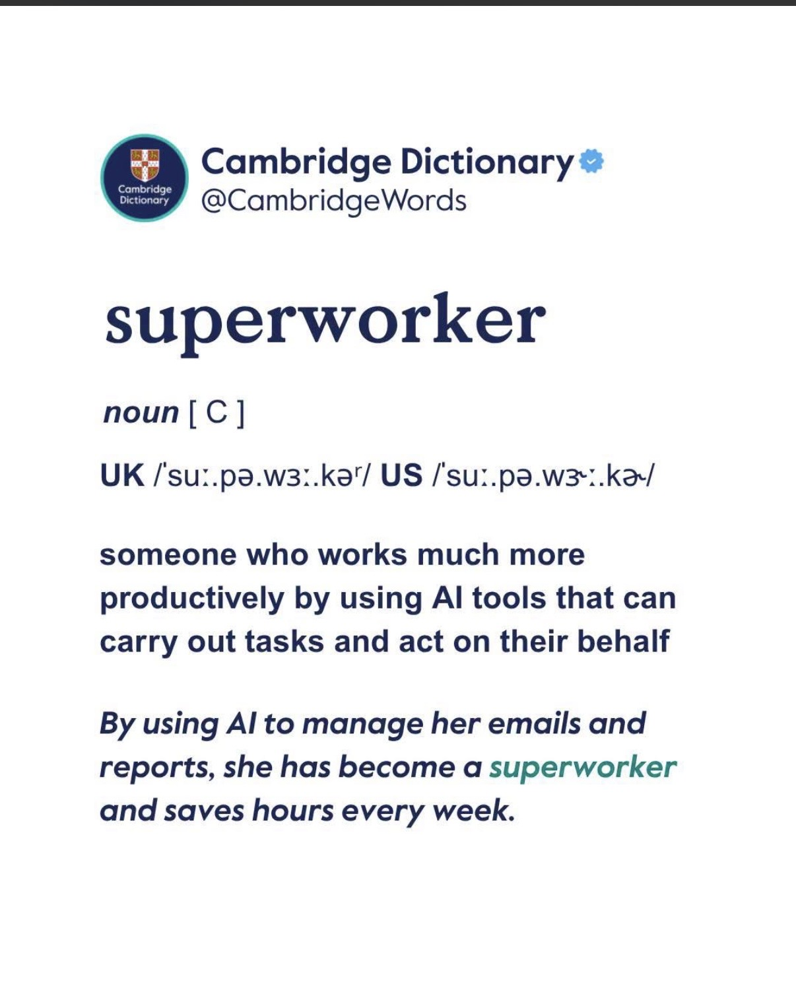

# AI Agent Skills




[](LICENSE)
[](https://github.com/nphausg/aiagent.skills/pulls)
[](https://github.com/nphausg/aiagent.skills/stargazers)

> **Become a superworker.** Someone who works much more productively by using AI tools that can carry out tasks and act on their behalf. — *Cambridge Dictionary*

Your AI agent is capable. But without the right guardrails, it guesses at architecture, skips tests, and ignores platform conventions. **AI Agent Skills** solves that — a battle-tested library of **skills and rules** that give Claude Code, Cursor, and compatible agents the discipline, judgment, and domain knowledge of a senior engineer, encoded once and applied automatically to every prompt, every file, every project.

---

## Why This Exists

Out of the box, AI coding agents are capable but undisciplined. They generate code that works in isolation but violates architecture boundaries, skips test coverage, or ignores platform conventions. This repo fixes that by encoding hard-won engineering standards into two complementary layers:

- **Skills** — active behaviors: slash commands that give agents a structured process to follow for complex tasks (debugging, multi-agent orchestration, etc.)
- **Rules** — passive guardrails: `.mdc` files loaded by Cursor that enforce architecture, naming, and testing patterns on every code generation

Together they turn a capable AI into a reliable engineering partner.

---

## Agent Skills

Skills live in `skills/` and install as Claude Code slash commands. Each skill is a `SKILL.md` file that defines a structured process the agent follows when invoked.

### Install a skill

```bash
mkdir -p .claude/skills/<skill-name>
cp skills/<skill-name>/SKILL.md .claude/skills/<skill-name>/SKILL.md
```

---

### `/debug` — Structured Bug Diagnosis

**Problem it solves:** Agents jump to guesses. This skill forces a disciplined root-cause process before touching any code.

```
/debug [paste error or description]
```

The agent follows a fixed four-step pipeline:

1. **Gather** — collects structured context: problem · expected · actual · code · error · env · tried
2. **Diagnose** — identifies the root cause in one sentence, not a symptom
3. **Fix** — shows a minimal diff; no rewrites, no style changes, no scope creep
4. **Verify** — tells you exactly how to confirm the fix worked (command, assertion, or observable behavior)

Rules the agent must obey: never guess without labeling it a hypothesis; never propose more than one fix per response; never refactor beyond what directly fixes the bug.

---

### `/friday` — Multi-Agent Task Orchestration

**Problem it solves:** Complex coding tasks need more than one agent. `/friday` is a coordination loop that drives tasks end-to-end through independent agents with human approval gates and evidence-based quality checks.

```
brainstorm → plan → approve → implement → review → smoke-test → ship
```

The **orchestrating session only coordinates** — it never writes feature code itself. Each phase is delegated:

| Phase | Agent | Responsibility |
| --- | --- | --- |
| Plan | Fable (or Opus 4.8 fallback) | Explores repo, writes a self-contained `plan.md` |
| Implement | Codex `gpt-5.5` at `xhigh` | Edits files from the plan — never commits |
| Review | Codex adversarial-review | Independent non-Claude reviewer; finds issues or approves |
| Smoke test | Opus | Proves the change actually runs with captured evidence |
| Ship | Orchestrator | Commits and pushes only after all gates pass |

**Two modes:**

| Mode | Trigger | When to use |
| --- | --- | --- |
| Full loop | `"friday"` / `"run the friday loop"` | You have a task description; want the full pipeline including brainstorm + plan |
| Execute mode | `"friday this plan"` / `"friday <file>.md"` | You already have a plan file; skip to implement → review → ship |

**Quality gates (non-negotiable):**

- No implementation without explicit plan approval
- No PASS on smoke test without shown evidence
- No self-review — review must be an independent agent
- No committing orchestration artifacts

---

## Cursor Rules

Rules live in `.cursor/rules/` and are loaded automatically by Cursor IDE based on `globs` in their frontmatter. They are passive — they apply to every matching file without any invocation.

### Install rules

```bash
git clone https://github.com/nphausg/aiagent.skills.git
cp -r aiagent.skills/.cursor/rules/ your-project/.cursor/rules/
```

Or manually copy any rule block and prepend it to your prompt.

---

### Android (8 rules)

| Rule file | Enforces |
| --- | --- |
| `android_clean_architecture.mdc` | Domain / Data / Presentation layers; all business logic in `UseCase` |
| `android_di_hilt_patterns.mdc` | `@HiltViewModel`, `@Inject`, `@Module` — consistent Hilt wiring |
| `android_general_rules.mdc` | MVVM: `ViewModel` + `StateFlow` + `UiState` sealed classes |
| `android_naming_conventions.mdc` | File, class, and function naming aligned with Kotlin idioms |
| `android_unit_testing_bdd.mdc` | BDD-style names (`given_when_then`), MockK/Mockito, `runTest` |
| `android_integration_testing.mdc` | Integration test structure and Hilt test component setup |
| `android_ui_testing.mdc` | Compose / Espresso UI testing patterns |
| `android_workmanager_best_practices.mdc` | WorkManager constraints, chaining, and retry strategies |

### Frontend (1 rule)

| Rule file | Enforces |
| --- | --- |
| `react_hooks.mdc` | Functional components · `useEffect` cleanup · `useCallback` / `useMemo` stability |

### General (2 rules)

| Rule file | Enforces |
| --- | --- |
| `general_clean_code_principles.mdc` | Single Responsibility, DRY, `lazy` initialization, avoid reflection |
| `general_performance_tips.mdc` | Lazy loading, memory allocation, recomposition avoidance |

### iOS

Coming soon — contributions welcome.

---

## Contributing

Pull requests are welcome. The highest-value area to contribute right now is **iOS rules** — the directory is empty and ready.

Before submitting a new rule, verify:

| Check | Criteria |
| --- | --- |
| Naming & location | File name is descriptive; placed in the correct category folder |
| `globs` accuracy | Patterns match only the intended file types |
| Clarity | Every rule is actionable and unambiguous |
| Conciseness | No redundancy; target under ~100 lines |
| Consistency | No conflicts with existing rules |
| Token efficiency | Run `python scripts/analyze_token_usage.py` — flag if > 1500 tokens |
| AI compliance | Run `OPENAI_API_KEY=... python scripts/run_ai_prompt_tests.py` |

Use the PR template in `.github/pull_request_template.md`.

---

## Support

[](https://revolut.me/nphausg)

---

## Author

[](https://nphausg.medium.com)

**nphausg** · [Medium](https://nphausg.medium.com) · [GitHub](https://github.com/nphausg)

---

[MIT](LICENSE) © nphausg
